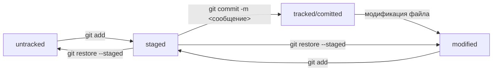

# git_notes
## Рабочие заметки по git

### Начальная настройка работы с git

Настройка имени пользователя и почты (глобально)

```
git config --global user.name "Имя_пользователя"
git config --global user.email "адрес@почты.з"
```

Настройка имени пользователя и почты (локально для репозитория)

```
git config --local user.name "Имя_пользователя"
git config --local user.email "адрес@почты.з"
```

Просмотр текущих параметров настройки
```
git config --list
```

### Начало работы с репозиторием

Инициализация нового репозитория в какой-либо рабочей папке:

```
cd <рабочая_папка>
git init
```


Копирование репозитория на локальную машину с удаленного репозитория github:
```
git clone git@github.com:имя_пользователя/имя_репозитория.git
```

### Основные команды работы с репозиторием

Проверка статуса текущего репозитория:
```
git status
```


Добавление в индекс отдельного файла (его изменений):
```
git add <имя_файла>
``` 

Добавление в индекс всех изменений текущего каталога:
```
git add --all
```
или
```
git add .
```

Интерактивный режим добавления файлов в индекс:
```
git add -i
```

Чтоб навсегда исключить добавление некоторых файлов в индекс по командам `add .` или `add --all` необходимо добавить эти файлы в файла .gitignore  
**.gitignore** - файл исключений, которые не попадают в индексирование git

Просмотреть список файлов, которые игнорируются:
```
git status --ignored
```

Фиксирование добавленных в индекс изменений в репозитории:
```
git commit -m "Осмысленное сообщение об изменениях."
```

Изменение/правка последнего коммита в репозитории с изменением сообщения:
```
git commit --amend -m "Осмысленное сообщение об изменениях."
```

Изменение последнего коммита, но сообщение оставить пержним:
```
git commit --amend --no-edit 
```

Просмотр истории изменений:
```
git log
```

Просмотр истории изменений в сокращенном варианте (хэш тоже сокращенный)
```
git log --oneline
```

Просмотр истории изменений с отображением изменений (diff):
```
git log -p
```

### Статусы файлов репозитория

- untracked - неотслеживаемый файл, который не добавлен в индекс
- tracked - отслеживаемый файл (добавлен в индекс)
    - modified - измененный файл (изменения не добавлены в индекс)
    - staged - изменения файла добавлены в индекс (но еще не закомиччены)

**Схема изменения статусов файла репозитория**



### Отмена выполненных изменений

Убрать файл из индекса (перевести в статус untracked/modified):
```
git restore --staged <имя_файла>
```

Отменить историю изменений (откатить рабочую копию на заданный коммит):
```
git reset --hard <hash коммита>
```
**Все! изменения, сделанные после <hash коммита> будут безвовзратно утрачены!**

Откатить изменения в рабочей копии файла до состояния, которое было сохранено по команде в git add или git commit
```
git restore <имя_файла>
```

### Анализ изменений

Сравнение модифицированных файлов с их закоммиченными версиями
```
git diff
```

Сравнение зафиксированных (staged) файлов с их закоммиченными версиями
```
git diff --staged
```

Сравнение двух разных коммитов
```
git diff <hash коммита 1> <hash коммита 2>
```


### Работа с удаленным репозиторием

Синхронизация локального и удаленного репозиториев
```
git remote add origin https://github.com/<имя_пользователя>/<наименование_репозитория>.git
```

Просмотреть подробную информацию о связи локального и удаленного репозиториев
```
git remote -v
```

Первоначальная отправка всех коммитов из локального репозитория в удаленный
```
git push -u origin main
```

Отправка текущих изменений из локального репозитория в удаленный репозиторий
```
git push
```

